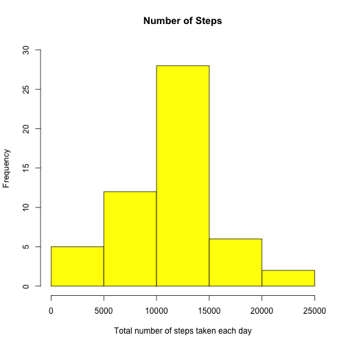
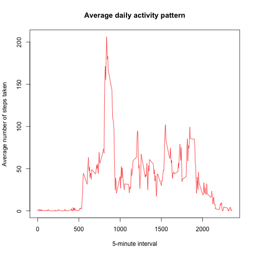
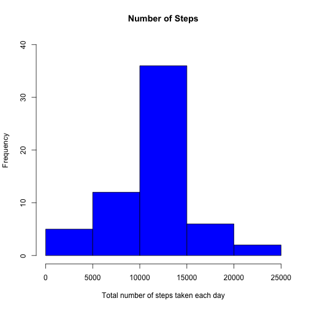
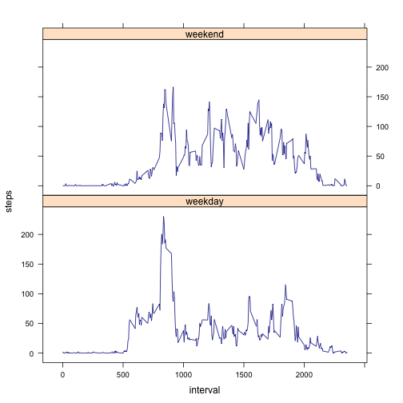

Reproducible Research - Peer Assessments 1
========================================================

## Loading and preprocessing the data

```r
# 1. Load the data
data <- read.csv("activity.csv")

# 2. Process/transform the data (if necessary) into a format suitable for
# your analysis
dataHasNoNA <- na.omit(data)
```


## What is mean total number of steps taken per day?

```r
# 1. Make a histogram of the total number of steps taken each day
library(plyr)
totalByDay <- ddply(dataHasNoNA, .(date), summarise, steps = sum(steps))
hist(totalByDay$steps, main = "Number of Steps", xlab = "Total number of steps taken each day", 
    col = "yellow", ylim = c(0, 30))
```

 

```r

# 2.Calculate and report the mean and median total number of steps taken per
# day
mean(totalByDay$steps)
```

```
## [1] 10766
```

```r
median(totalByDay$steps)
```

```
## [1] 10765
```


## What is the average daily activity pattern?

```r
# 1. Make a time series plot (i.e. type = 'l') of the 5-minute interval
# (x-axis) and the average number of steps taken, averaged across all days
# (y-axis)

averageByInterval <- ddply(dataHasNoNA, .(interval), summarise, steps = mean(steps))
plot(averageByInterval$interval, averageByInterval$steps, type = "l", main = "Average daily activity pattern", 
    xlab = "5-minute interval", ylab = "Average number of steps taken", col = "Red")
```

 

```r


# 2. Which 5-minute interval, on average across all the days in the dataset,
# contains the maximum number of steps?
averageByInterval[averageByInterval$steps == max(averageByInterval$steps), ]
```

```
##     interval steps
## 104      835 206.2
```

```r
colnames(averageByInterval)[2] <- "intervalAverage"
```


## Imputing missing values

```r
# 1. Calculate and report the total number of missing values in the dataset
# (i.e. the total number of rows with NAs) nrow(data) - nrow(dataHasNoNA)
sum(is.na(data$steps))
```

```
## [1] 2304
```

```r


# 2. Devise a strategy for filling in all of the missing values in the
# dataset. The strategy does not need to be sophisticated. For example, you
# could use the mean/median for that day, or the mean for that 5-minute
# interval, etc.

mergedData <- arrange(join(data, averageByInterval), interval)
```

```
## Joining by: interval
```

```r


# 3. Create a new dataset that is equal to the original dataset but with the
# missing data filled in.
mergedData$steps[is.na(mergedData$steps)] <- mergedData$intervalAverage[is.na(mergedData$steps)]

# 4. Make a histogram of the total number of steps taken each day and
# Calculate and report the mean and median total number of steps taken per
# day. Do these values differ from the estimates from the first part of the
# assignment? What is the impact of imputing missing data on the estimates
# of the total daily number of steps?

totalByDayByMergedData <- ddply(mergedData, .(date), summarise, steps = sum(steps))
hist(totalByDayByMergedData$steps, main = "Number of Steps", xlab = "Total number of steps taken each day", 
    col = "Blue", ylim = c(0, 40))
```

 

```r

# Calculate and report the mean and median total number of steps taken per
# day
mean(totalByDayByMergedData$steps)
```

```
## [1] 10766
```

```r
median(totalByDayByMergedData$steps)
```

```
## [1] 10766
```

```r
totalDataHasNoNASteps <- sum(dataHasNoNA$steps)
totalMergedDataSteps <- sum(mergedData$steps)
totalDifference <- totalMergedDataSteps - totalDataHasNoNASteps
print(totalDifference)
```

```
## [1] 86130
```

```r

# Mean values didn't change, however median and histogram were changed.The
# difference between mergedData and originalData without NA 86130 steps
```


## Are there differences in activity patterns between weekdays and weekends?

```r

# 1. Create a new factor variable in the dataset with two levels – “weekday”
# and “weekend” indicating whether a given date is a weekday or weekend day.
library(lattice)
weekdays <- weekdays(as.Date(mergedData$date))
mergedDataWithWeekdays <- transform(mergedData, day = weekdays)
mergedDataWithWeekdays$weekendOrday <- ifelse(mergedDataWithWeekdays$day %in% 
    c("Saturday", "Sunday"), "weekend", "weekday")
averageIntervalWeekendOrday <- ddply(mergedDataWithWeekdays, .(interval, weekendOrday), 
    summarise, steps = mean(steps))

# 2. Make a panel plot containing a time series plot (i.e. type = 'l') of
# the 5-minute interval (x-axis) and the average number of steps taken,
# averaged across all weekday days or weekend days (y-axis). The plot should
# look something like the following, which was creating using simulated
# data:

xyplot(steps ~ interval | weekendOrday, data = averageIntervalWeekendOrday, 
    layout = c(1, 2), type = "l", par.settings = simpleTheme(col = "Dark blue"))
```

 


